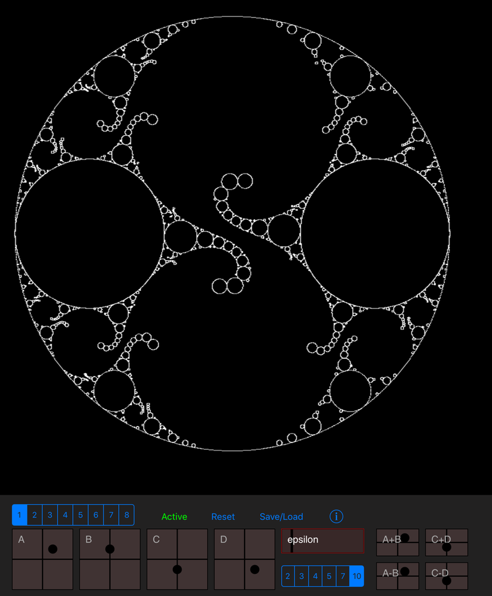

# LimMetal
Kleinian and Quasi-Fuchsian Limit Sets for iPad using Swift and Metal

Please visit: https://dhushara.com/DarkHeart/quasif/quasi.htm
This app is based on the ideas presented in "Depth First C-script Listing in Colour".
I have done many little things in the process of porting it to the iPad,
but the credit belongs to the author of that code.

